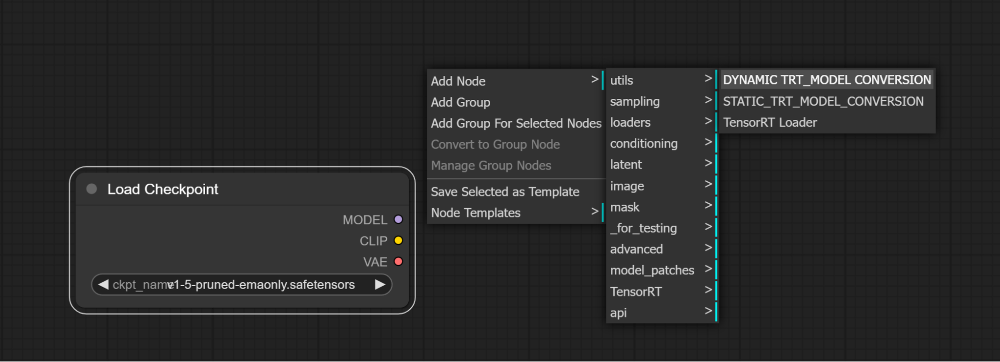
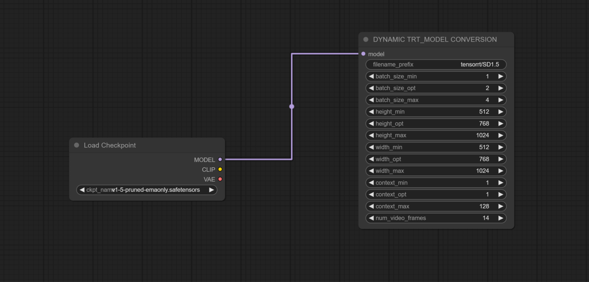
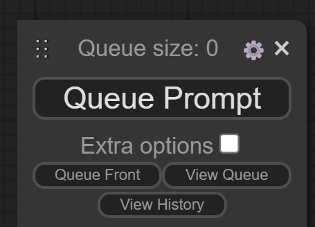
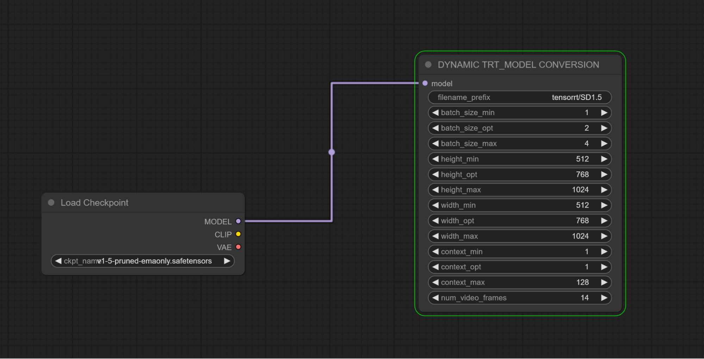
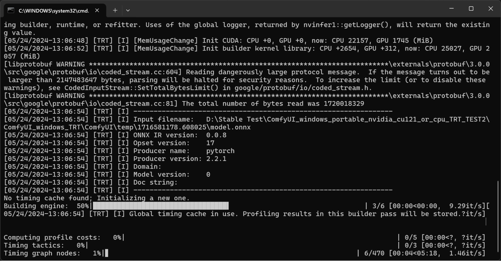
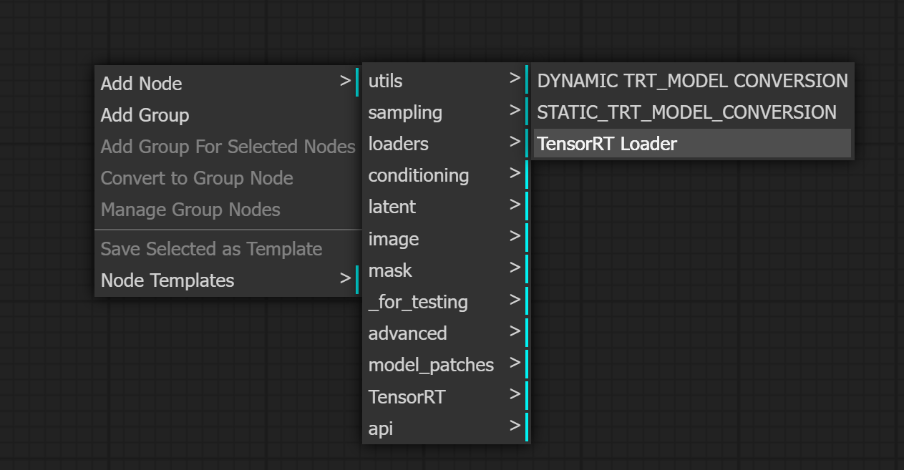
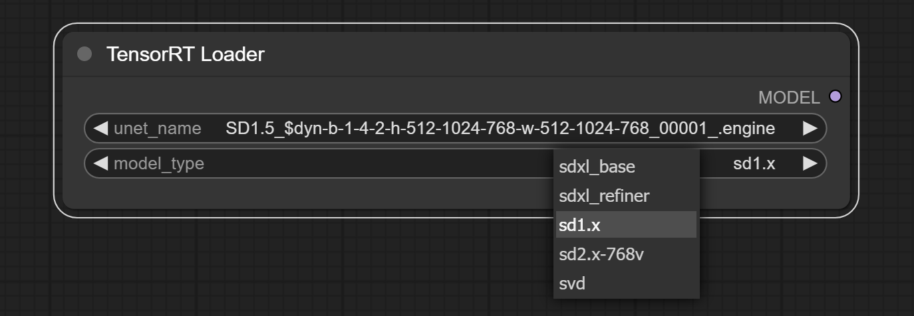
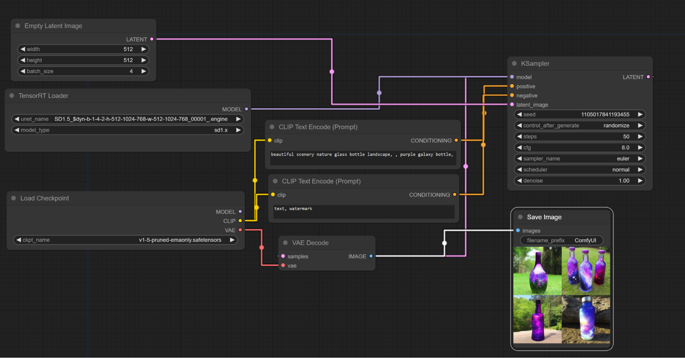

# TensorRT Node for ComfyUI

This node enables the best performance on NVIDIA RTX™ Graphics Cards
 (GPUs) for Stable Diffusion by leveraging NVIDIA TensorRT.

Supports:

- Stable Diffusion 1.5
- Stable Diffusion 2.1
- Stable Diffusion 3.0
- SDXL
- SDXL Turbo
- Stable Video Diffusion
- Stable Video Diffusion-XT 

Requirements:

- GeForce RTX™ or NVIDIA RTX™ GPU
- For SDXL and SDXL Turbo, a GPU with 12 GB or more VRAM is recommended
  for best performance due to its size and computational intensity.
- For Stable Video Diffusion (SVD), a GPU with 16 GB or more VRAM is
  recommended.
- For Stable Video Diffusion-XT (SVD-XT), a GPU with 24 GB or more VRAM
  is recommended.

## Installing

The recommended way to install these nodes is to use the [ComfyUI Manager](https://github.com/ltdrdata/ComfyUI-Manager)
to easily install them to your ComfyUI instance.

You can also manually install them by git cloning the repo to your ComfyUI/custom_nodes folder and installing the requirements like:

```
cd custom_nodes
git clone https://github.com/comfyanonymous/ComfyUI_TensorRT
cd ComfyUI_TensorRT
pip install -r requirements.txt
```

## Description

NVIDIA TensorRT allows you to optimize how you run an AI model for your
specific NVIDIA RTX GPU, unlocking the highest performance. To do this,
we need to generate a TensorRT engine specific to your GPU.

You have the option to build either dynamic or static TensorRT engines:

- Dynamic engines support a range of resolutions and batch sizes,
  specified by the min and max parameters. Best performance will occur
  when using the optimal (opt) resolution and batch size, so specify opt
  parameters for your most commonly used resolution and batch size.

&nbsp;

- Static engines only support a single resolution and batch size. These
  provide the same performance boost as the optimal settings for the
  dynamic engines.

Note: Most users will prefer dynamic engines, but static engines can be
useful if you use a specific resolution + batch size combination most of
the time. Static engines also require less VRAM; the wider the dynamic
range, the more VRAM will be consumed.

## Instructions

You can find different workflows in the [workflows](workflows) folder of this repo.
These .json files can be loaded in ComfyUI.

### Building A TensorRT Engine From a Checkpoint

1.  Add a Load Checkpoint Node
2.  Add either a Static Model TensorRT Conversion node or a Dynamic
    Model TensorRT Conversion node to ComfyUI
3.  
4.  Connect the Load Checkpoint Model output to the TensorRT Conversion
    Node Model input.
5.  
6.  
7.  To help identify the converted TensorRT model, provide a meaningful
    filename prefix, add this filename after “tensorrt/”
8.  

9.  Click on Queue Prompt to start building the TensorRT Engines
10. 



The Model Conversion node will be highlighted while the TensorRT Engine
is being built.

Additional information about the model conversion process can be seen in
the console.



The first time generating an engine for a checkpoint will take awhile.
Additional engines generated thereafter for the same checkpoint will be
much faster. Generating engines can take anywhere from 3-10 minutes for
the image generation models and 10-25 minutes for SVD. SVD-XT is an
extremely extensive model - engine build times may take up to an hour.

------------------------------------------------------------------------

### Accelerated Image Generation Using a TensorRT Engine

TensorRT Engines are loaded using the TensorRT Loader node.



## Common Issues/Limitations

ComfyUI TensorRT engines are not yet compatible with ControlNets or
LoRAs. Compatibility will be enabled in a future update.

1.  Add a TensorRT Loader node
2.  Note, if a TensorRT Engine has been created during a ComfyUI
    session, it will not show up in the TensorRT Loader until the
    ComfyUI interface has been refreshed (F5 to refresh browser).
3.  
4.  Select a TensorRT Engine from the unet_name dropdown
5.  Dynamic Engines will use a filename format of:

&nbsp;

1.  dyn-b-min-max-opt-h-min-max-opt-w-min-max-opt
2.  dyn=dynamic, b=batch size, h=height, w=width

&nbsp;

6.  Static Engine will use a filename format of:

&nbsp;

1.  stat-b-opt-h-opt-w-opt
2.  stat=static, b=batch size, h=height, w=width

&nbsp;

7.  
8.  The model_type must match the model type of the TensorRT engine.
9.  
10. The CLIP and VAE for the workflow will need to be utilized from the
    original model checkpoint, the MODEL output from the TensorRT Loader
    will be connected to the Sampler.
